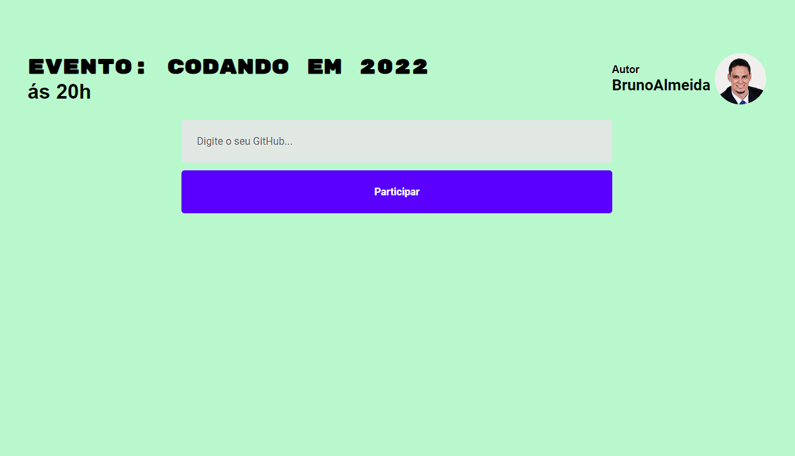

# Modelo de Evento ou Lista de presença com React

## Conteúdo

- [Projeto](#projeto)
  - [Desafio](#desafio)
  - [Video](#video)
  - [Links](#links)
  - [Processo de Criação](#processo-de-criação)
  - [Construído com](#construído-com)
  - [Aprendizado](#aprendizado)
- [Autor](#autor)

## Projeto

Esse projeto consiste em criar uma lista interativa criando um Cartão de presença.

### Desafio

O maior desafio desse projeto conhecer e realizá-lo com a biblioteca [React.js](https://reactjs.org/) como primeiro projeto. Utilizei meu HTML, CSS, Javascript de forma diferente nesse projeto.

### Video

<div style="display: inline-block"  align="center"><br>
   <!--  <br><br><br> -->
   
  
  <br><br>
</div>

### Links

- URL para o Site: [Lista de presença](https://projeto-react-lista-de-presen-a.vercel.app/)

## Processo de Criação

### Construído com

- HTML Construido em JavaScript(JSX)
- CSS Estilizando componentes separadamente
- React
  - Hooks, useState, Api do GitHub
- Javascript
  - Fecth, async - await, função Date().toLocaleDateString

### Aprendizado

O projeto consiste em uma aplicação React utilizando o Vite ao invés de por padrão utilizar o "create-react-app".

```
npm create vite@latest <nome do projeto>
cd <nome do projeto>
npm install <criação da pasta node_modules>
npm run dev
```

O aprendizado consiste em desenvolver um projeto react desde a criação ao deploy, utilizando todos estes conteúdos base: propriedades, estado, como desenvolver utilizando componentilização, estilização, hooks (useState, useEffect), imutabilidade, entender o funcionamento e o comportamento de aplicações react.

## Autor

<table>
  <tr>
    <td align="center">
      <a href="https://www.linkedin.com/in/rafael99ldm/">
        <br>
        <sub>
          <b>Bruno Almeida</b>
        </sub>
      </a>
    </td>
  </tr>
</table>
